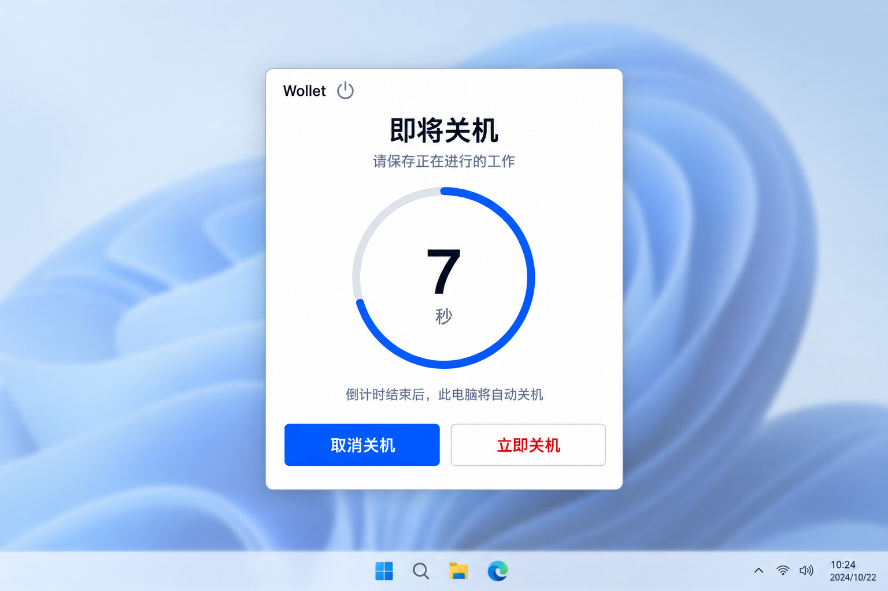

# v1.1.0 同步关机开发规划

状态：功能已接入，正在联合验收。日期：2026-09-19。

本规划落实 [同步关机协议](shutdown-plan-protocol.md) 与 Windows 倒计时弹窗，属于 [v1.1.0 开发计划](../development-plan.md) 的第二项改动。

## 交付目标

管理页面发起关机后，客户端自动接受固定 10 秒计划，后台服务负责计时和执行。有可交互桌面时居中显示倒计时弹窗，用户可在本地取消或立即关机；操作不需要服务端在线或额外确认弹窗。

关闭网页、断网、锁屏或无人登录不影响已接受计划。客户端后台服务重启或升级会取消未执行计划。新旧版本通过能力协商保持兼容。

本版本不实现动态修改时长、休眠、长时预约或自动下载更新。

## UI 与交互

图片是视觉参考，桌面背景、任务栏及背景模糊不属于应用实现范围。沿用现有 WinForms 技术，按运行时 DPI 绘制文字与圆环，不把整张效果图作为窗口背景。

### 布局

- 白色紧凑弹窗，轻边框、适度圆角和阴影，保留 Wollet 标识。
- 顶部标题“即将关机”，说明“请保存正在进行的工作”。
- 中部为完整 360 度浅灰轨道，蓝色弧线表示剩余时间；中央显示大号秒数及“秒”。
- 圆环下方显示“倒计时结束后，此电脑将自动关机”。
- 底部左侧为蓝色主按钮“取消关机”，右侧为白底红字次按钮“立即关机”。
- 不提供关闭、最小化或隐藏按钮。原生关闭消息、Alt+F4 和 Escape 按取消请求处理，不能静默隐藏窗口后继续关机。

### 倒计时与状态

圆环起点位于 12 点方向，剩余弧线按 `剩余毫秒 / 总时长` 递减；初始为整圈，7 秒时约剩 70%。数字向上取整，执行中显示“正在关机”，不在零秒状态继续允许操作。动画只负责显示，不能在 UI 线程调用关机。

弹窗从后台服务快照获得基准剩余时间，使用单调时间平滑刷新；窗口创建较晚、解锁或重新连接提示进程时，只显示实际剩余时间，不重新开始十秒。

| 场景 | 弹窗行为 |
| --- | --- |
| 收到活动计划 | 自动出现在目标屏幕中央，无需用户点击接受 |
| 点击取消 | 向本地后台服务提交取消，收到本地结果后关闭窗口 |
| 点击立即关机 | 向同一计划引擎请求立即执行，禁用重复操作并显示执行状态 |
| 网络断开 | 保持倒计时，本地取消与立即执行均可用 |
| 本地 IPC 中断 | 标明状态未同步，不显示取消成功；尝试重新连接并保留错误提示 |
| 取消时已进入执行 | 显示“关机已开始，无法取消”，不宣称取消成功 |
| 系统关机失败 | 显示失败原因及关闭入口，不自动重试关机 |
| 远端取消 | 根据后台服务结果关闭弹窗 |

键盘默认焦点放在“取消关机”，不得把 Enter 默认绑定到立即关机。支持 Tab、按钮可访问名称、高 DPI 和高对比度；倒计时读屏避免每帧重复播报。窗口出现时不抢占正在输入的键盘焦点，进入窗口后默认操作仍是取消。

初次定位建议使用活动控制台会话的主显示器工作区中央，保持可见且不超出工作区；多显示器和会话切换在桌面验证阶段确认。

## 实现拆分与依赖顺序

各阶段独立完成并验证，在同一个 `v1.1.0` 版本交付。下面的完成条件是开发检查点，不代表独立发布。

### 阶段 1：协议契约与桌面运行方案

- 固化 Go 与 C# 的消息结构、状态枚举、错误码、能力名称以及 JSON 示例。
- 将本地立即关机纳入计划引擎，统一处理本地与远端立即执行、取消及到期竞争。
- 编写两端共用的消息样例，校验序列化字段、未知能力降级和四 KiB 限制。
- 验证后台服务向用户会话展示窗口的运行方式。现有主程序使用管理员权限 manifest，桌面提示不能直接沿用该入口而在每次登录时弹出 UAC。
- 优先评估独立、普通用户权限的提示进程，通过安装器管理部署与登录启动，继续保持用户下载一个客户端发行文件的体验；验证通过后确定打包和启动方式。
- 确定 IPC 身份校验、系统睡眠恢复及多用户会话规则。后两项仍是协议草案的待定边界。

完成条件：消息契约可测试，普通用户会话能连接后台服务并展示模拟计划，安装和登录不引入额外权限确认。此阶段仅用模拟关机控制器。

### 阶段 2：客户端计划引擎与存储

主要范围：`Wollet.Client.Core`、客户端测试项目及 Windows 服务适配层。

- 将计划生命周期从 WebSocket 生命周期中分离，使用可注入时钟和关机控制器。
- 实现单活动计划、修订号、自动回执、指令去重及状态上报。
- 用同一串行处理入口裁决计时到期、本地取消、本地立即关机和远端操作。
- 持久化计划与指令结果，处理启动恢复、执行结果未知及存储错误；计划存储独立于设备凭据文件。
- 允许服务账户写入计划目录，同时保持现有设备密钥的访问权限，不为提示进程开放凭据。
- 实现重连同步及向旧协议降级时的计划处理。

完成条件：在没有真实窗口和网络的测试中，验证本地取消立即生效、断网继续计时、后台服务重启取消，以及每个计划最多调用一次系统关机接口。

### 阶段 3：服务端协调、存储与模拟客户端

主要范围：`internal/protocol`、`internal/devicehub`、`internal/server`、`internal/store` 和 `cmd/wollet-sim`。

- 握手协商能力与会话 ID，处理客户端结果、状态及重连同步。
- 新增计划管理 API、请求去重、五秒回执等待及结果未知的查询流程。
- 增加数据库迁移，保存请求和客户端确认状态，落实记录保留规则。
- 扩展设备视图及 SSE，分别表示设备在线状态、请求结果和关机计划。
- 保留旧客户端流程，阻止旧管理页面绕过新版计划机制。
- 扩展模拟客户端，模拟倒计时、取消、立即执行、断线和重连，供联调使用。

完成条件：通过契约与集成测试，重复请求和服务端重启不导致重发关机；取消请求不被等待前一条回执的锁阻塞。

### 阶段 4：Windows 弹窗与本地控制

主要范围：桌面提示进程、Windows 服务 IPC、安装/更新/卸载流程。

- 按效果图实现居中弹窗、平滑圆环、秒数和两个操作按钮。
- 通过有访问控制的本地 IPC 订阅快照，提交携带计划 ID 的取消或立即执行请求。
- 后台服务验证真实调用者的 Windows 身份和会话，不能只相信消息中的会话 ID。只有允许的本地会话可以操作当前计划。
- 锁屏、无人登录或提示进程退出时继续后台计划；用户返回后恢复实际剩余时间。
- 安装器负责提示组件的部署与清理。更新需停止占用程序文件的提示进程，并与现有程序替换、失败恢复流程一致；计划因后台服务重启取消。
- 保持两种客户端发行形式可用，避免要求用户手动启动第二个程序。

完成条件：在 Windows 桌面检查 100%、150%、200% 缩放、键盘操作、文本截断、窗口定位、锁屏恢复和提示进程重启。所有按钮通过本地引擎执行，不直接调用系统关机 API。

### 阶段 5：管理页面接入

主要范围：`internal/webui/assets/app.js`、对应 HTML/CSS。

- 新版设备点击关机即创建计划，不再先在浏览器等待十秒。
- 根据 SSE 快照显示剩余时间、取消与立即执行结果；请求未知时明确提示并查询。
- 页面关闭或刷新不改变客户端计划；重新打开后恢复状态视图。
- 本地用户取消或立即执行后，页面同步更新；旧设备仍使用原流程。
- 保持当前极简管理界面，不引入时长编辑、休眠选项或计划列表。

完成条件：模拟客户端联调覆盖页面刷新、多页面操作、回执丢失和本地操作上报；客户端与页面不会各自开启一轮倒计时。

### 阶段 6：联合验收与测试构建

- 运行 Go 与 .NET 的相关测试；检查协议样例和实际序列化输出一致。
- 使用递增的 `1.1.0-dev.N` 构建测试文件，验证旧版本更新保留配对，再测试同步关机。
- 对包含 Runtime 与 framework-dependent 两种发行形式分别验证安装、更新、修复、卸载及桌面提示启动。
- 在专用 Windows 测试电脑执行真实关机验收；自动化测试和日常联调用模拟控制器。
- 若需要通过远端 tag 分发测试版，先调整 Release 预发布标记和容器标签，避免测试版覆盖正式版标签。
- 验收完成后更新现行协议文档、用户说明与发布说明，再发布 `v1.1.0`。

## 核心验收矩阵

| 类别 | 必测情形 | 通过标准 |
| --- | --- | --- |
| 基本流程 | 正常十秒、本地取消、本地立即关机、远端取消和立即执行 | 状态一致，每个计划只执行一次 |
| 网络 | 断网、回执丢失、重连、关闭网页 | 本地计划独立运行；未知结果不误报成功 |
| 竞争 | 到期同时取消、两端同时操作、重复消息 | 引擎统一裁决，终态不复活 |
| 生命周期 | 后台服务重启、升级、锁屏、无人登录、提示进程退出 | 重启取消；其余按协议继续，解锁不重新计时 |
| 失败恢复 | 存储失败、系统拒绝关机、执行边界崩溃 | 不自动重试，不把结果未知当作已取消 |
| 兼容 | 新服务端/旧客户端、旧服务端/新客户端、新新版 | 正确降级，仅协商成功后启用扩展 |
| UI | 高 DPI、键盘、长错误提示、多显示器、窗口关闭消息 | 清晰可操作，无意外触发立即关机 |

## 运行方案与验证进度

同一发行程序提供安装管理、后台服务和 `--desktop` 提示模式。程序默认使用普通权限，安装管理入口单独请求提权；登录启动项运行普通权限提示模式。正常双击安装时，原启动进程在安装完成后启动提示组件。直接以管理员身份运行时，关闭管理窗口后启动当前会话的提示组件；后续登录使用普通权限启动项。

本地 IPC 使用带 ACL 的命名管道，拒绝网络身份。服务检查操作进程是否属于活动控制台会话；提示进程核对服务进程的会话和受保护的安装路径。RDP 和非活动用户会话目前不展示提示、不接受本地操作。锁屏或无人登录时，后台计划仍按时执行。

睡眠及恢复通知取消未执行计划，记录 `system_resumed`。更新和卸载先发出退出标记，再等待提示进程释放会话互斥锁，随后替换或删除程序。计划目录的写权限独立授予服务账户，不开放设备凭据。

已完成的验证：

- .NET 计划引擎与连接测试：重复创建不重置计时、取消与到期竞争、存储失败、重启恢复、执行结果未知和断线后本地执行；全部使用模拟关机控制器。
- Go 集成测试：能力协商、同步前拦截、旧接口隔离、创建请求去重、过期快照不恢复终态、重启读取持久化记录。
- 浏览器联调：桌面 1280×900 与移动端 390×844，创建、取消、刷新恢复和立即执行通过；无页面脚本错误。现有 `/favicon.ico` 缺失产生一条 404，不影响操作。
- Windows 弹窗在当前 150% 缩放下完成实际渲染检查，修复初始 DPI 布局；没有执行真实关机。
- 两种单文件发行形式可构建，测试版本为 `1.1.0-dev.2`。

发布前仍需在专用 Windows 测试机验收真实服务安装、从旧版升级、IPC 权限、登录启动、锁屏、多用户切换、睡眠恢复及真实关机；补测 100% 和 200% 缩放。当前环境缺少 CGO 所需的 C 编译器，未运行 Go race detector。

客户端与服务端目前保留全部幂等历史，满足至少 24 小时的保留要求；暂未自动清理旧记录。尚未解决的创建请求保持结果未知，阻止再次创建，仍允许取消已知活动计划。

## 设计参考来源

参考图由内置 imagegen 生成，并经用户确认视觉方向。生成提示要点：Windows 屏幕中央的白色极简 Wollet 弹窗，浅灰整圆轨道与蓝色剩余弧线，中央显示 7 秒，底部蓝色“取消关机”和红字“立即关机”，无关闭按钮。完整交互以本文和协议为准。
