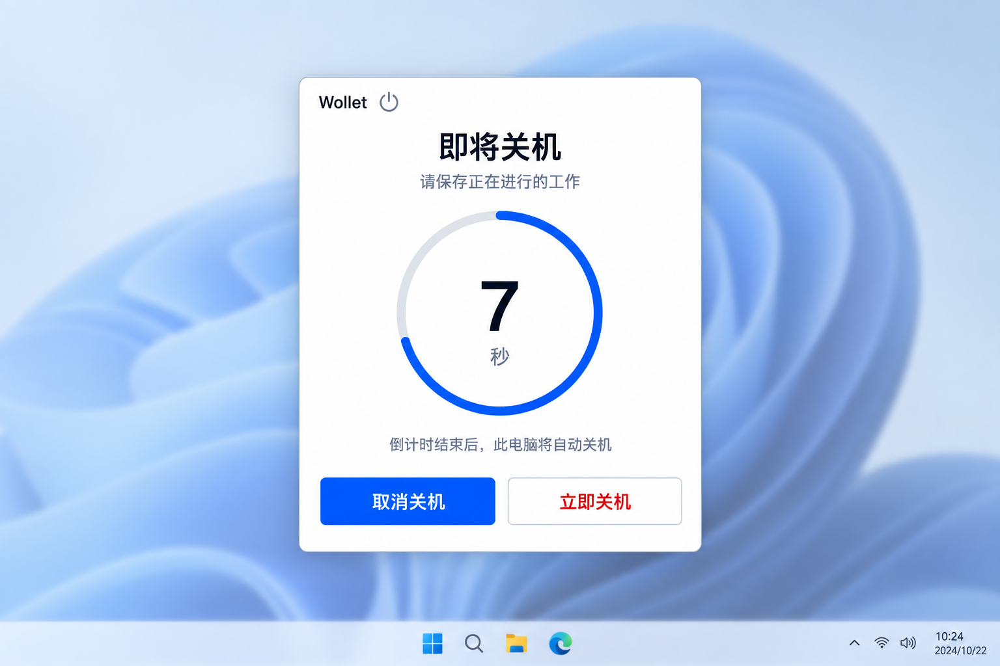

# v1.1.0 同步关机实现记录

> 历史记录：本文的 WinForms 界面与验证结果对应 v1.1.0，不作为 v1.2.0 的实现指南。现行协议见 [同步关机协议](shutdown-plan-protocol.md)，现行 Windows 架构和验证边界见 [WPF 迁移记录](wpf-migration.md)。

人工验收记录日期：2026-09-28。

本文记录 v1.1.0 的同步关机实现与验证。后续功能方向见 [开发规划](../development-plan.md)。

## 功能范围

管理页面发起关机后，客户端自动接受固定 10 秒计划，后台服务负责计时和执行。有可交互桌面时居中显示倒计时弹窗，用户可在本地取消或立即关机；操作不需要服务端在线或额外确认弹窗。

关闭网页、断网、锁屏或无人登录不影响已接受计划。客户端后台服务重启或升级会取消未执行计划。新旧版本通过能力协商保持兼容。

本版本不实现动态修改时长、休眠、长时预约或自动下载更新。

## UI 与交互

图片是视觉参考，桌面背景、任务栏及背景模糊不属于应用实现范围。当时使用 WinForms，按运行时 DPI 绘制文字与圆环，不把整张效果图作为窗口背景。

### 布局

- 白色紧凑弹窗，轻边框、适度圆角和阴影，保留 Wollet 标识。
- 顶部标题“即将关机”，说明“请保存正在进行的工作”。
- 中部为完整 360 度浅灰轨道，蓝色弧线表示剩余时间；中央显示大号秒数及“秒”。
- 圆环下方显示“倒计时结束后，此电脑将自动关机”。
- 底部左侧为蓝色主按钮“取消关机”，右侧为白底红字次按钮“立即关机”。
- 不提供关闭、最小化或隐藏按钮。原生关闭消息、Alt+F4 和 Escape 按取消请求处理，不能静默隐藏窗口后继续关机。

### 倒计时与状态

圆环起点位于 12 点方向，剩余弧线按 `剩余毫秒 / 总时长` 递减；初始为整圈，7 秒时约剩 70%。数字向上取整，执行中显示“正在关机”，不在零秒状态继续允许操作。动画只负责显示，不能在 UI 线程调用关机。

弹窗从后台服务快照获得基准剩余时间，使用单调时间平滑刷新；窗口创建较晚、解锁或重新连接提示进程时，只显示实际剩余时间，不重新开始十秒。

| 场景 | 弹窗行为 |
| --- | --- |
| 收到活动计划 | 自动出现在目标屏幕中央，无需用户点击接受 |
| 点击取消 | 向本地后台服务提交取消，收到本地结果后关闭窗口 |
| 点击立即关机 | 向同一计划引擎请求立即执行，禁用重复操作并显示执行状态 |
| 网络断开 | 保持倒计时，本地取消与立即执行均可用 |
| 本地 IPC 中断 | 标明状态未同步，不显示取消成功；尝试重新连接并保留错误提示 |
| 取消时已进入执行 | 显示“关机已开始，无法取消”，不宣称取消成功 |
| 系统关机失败 | 显示失败原因及关闭入口，不自动重试关机 |
| 远端取消 | 根据后台服务结果关闭弹窗 |

键盘默认焦点放在“取消关机”，不得把 Enter 默认绑定到立即关机。支持 Tab、按钮可访问名称、高 DPI 和高对比度；倒计时读屏避免每帧重复播报。窗口出现时不抢占正在输入的键盘焦点，进入窗口后默认操作仍是取消。

v1.1.0 弹窗定位在活动控制台会话的主显示器工作区中央，保持可见且不超出工作区。

## 核心验收矩阵

| 类别 | 必测情形 | 通过标准 |
| --- | --- | --- |
| 基本流程 | 正常十秒、本地取消、本地立即关机、远端取消和立即执行 | 状态一致，每个计划只执行一次 |
| 网络 | 断网、回执丢失、重连、关闭网页 | 本地计划独立运行；未知结果不误报成功 |
| 竞争 | 到期同时取消、两端同时操作、重复消息 | 引擎统一裁决，终态不复活 |
| 生命周期 | 后台服务重启、升级、锁屏、无人登录、提示进程退出 | 重启取消；其余按协议继续，解锁不重新计时 |
| 失败恢复 | 存储失败、系统拒绝关机、执行边界崩溃 | 不自动重试，不把结果未知当作已取消 |
| 兼容 | 新服务端/旧客户端、旧服务端/新客户端、新新版 | 正确降级，仅协商成功后启用扩展 |
| UI | 高 DPI、键盘、长错误提示、多显示器、窗口关闭消息 | 清晰可操作，无意外触发立即关机 |

## 运行方案与历史验证

同一发行程序提供安装管理、后台服务和 `--desktop` 提示模式。程序默认使用普通权限，安装管理入口单独请求提权；登录启动项运行普通权限提示模式。正常双击安装时，原启动进程在安装完成后启动提示组件。直接以管理员身份运行时，关闭管理窗口后启动当前会话的提示组件；后续登录使用普通权限启动项。

本地 IPC 使用带 ACL 的命名管道，拒绝网络身份。服务检查操作进程是否属于活动控制台会话；提示进程核对服务进程的会话和受保护的安装路径。RDP 和非活动用户会话不展示提示、不接受本地操作。锁屏或无人登录时，后台计划仍按时执行。

睡眠及恢复通知取消未执行计划，记录 `system_resumed`。更新和卸载先发出退出标记，再等待提示进程释放会话互斥锁，随后替换或删除程序。计划目录的写权限独立授予服务账户，不开放设备凭据。

已完成的验证：

- .NET 计划引擎与连接测试：重复创建不重置计时、取消与到期竞争、存储失败、重启恢复、执行结果未知和断线后本地执行；全部使用模拟关机控制器。
- Go 集成测试：能力协商、同步前拦截、旧接口隔离、创建请求去重、过期快照不恢复终态、重启读取持久化记录。
- 浏览器联调：桌面 1280×900 与移动端 390×844，创建、取消、刷新恢复和立即执行通过；无页面脚本错误。现有 `/favicon.ico` 缺失产生一条 404，不影响操作。
- Windows 弹窗在当前 150% 缩放下完成实际渲染检查，修复初始 DPI 布局；没有执行真实关机。
- 两种单文件发行形式完成本机验证构建。

2026-09-28，用户确认 Windows 倒计时已完成人工验收，桌面倒计时未弹出的问题已关闭。上述自动化与构建结果为此前验证记录；本次仅补记人工验收结论，未重新运行测试。

既有升级、配对与关机功能已由用户确认完成验收。此前自动化验证未运行 Go race detector。

客户端与服务端保留全部幂等历史，满足至少 24 小时的保留要求，没有自动清理机制。尚未解决的创建请求保持结果未知，阻止再次创建，仍允许取消已知活动计划。

## 设计参考来源

参考图由内置 imagegen 生成，并经用户确认视觉方向。生成提示要点：Windows 屏幕中央的白色极简 Wollet 弹窗，浅灰整圆轨道与蓝色剩余弧线，中央显示 7 秒，底部蓝色“取消关机”和红字“立即关机”，无关闭按钮。完整交互以本文和协议为准。
